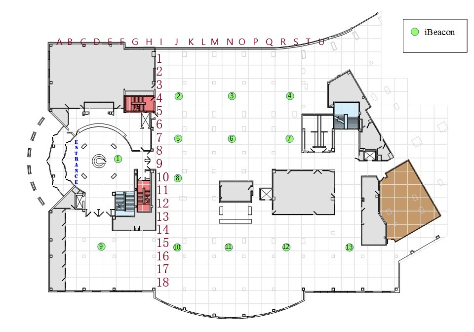
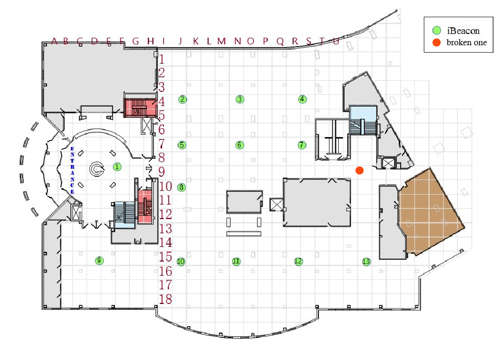

# python-machine-learning-clustering
For the beginners who would like to learn ML/DL.

python-machine-learning-Classification
For the beginners who would like to learn ML/DL.

In this example,we can learn how to use scikit-learn to have some cluster analysis. Clustering is a kind of Unsupervised learning which infers a function to describe hidden structure from “unlabeled” data .

1.BLE RSSI Dataset for Indoor localization and Navigation Data Set 

* Dataset: http://archive.ics.uci.edu/ml/datasets/BLE+RSSI+Dataset+for+Indoor+localization+and+Navigation
* Abstract: The dataset was created using the RSSI readings of an array of 13 ibeacons in the first floor of Waldo Library, Western Michigan University. Data was collected using iPhone 6S. The dataset contains two sub-datasets: a labeled dataset (1420 instances) and an unlabeled dataset (5191 instances). The recording was performed during the operational hours of the library. For the labeled dataset, the input data contains the location (label column), a timestamp, followed by RSSI readings of 13 iBeacons. RSSI measurements are negative values. Bigger RSSI values indicate closer proximity to a given iBeacon (e.g., RSSI of -65 represent a closer distance to a given iBeacon compared to RSSI of -85). For out-of-range iBeacons, the RSSI is indicated by -200. The locations related to RSSI readings are combined in one column consisting a letter for the column and a number for the row of the position. The attached figure depicts the layout of the iBeacons as well as the arrange of locations. 

I would like to use this dataset to locate the region we are. Of course we can use some algorithm like UWB(Ultra-Wide-Band) to get the target. But we can do this by ML ,it might be a good issue to discuss.

2.Creativity Dataset

* Dataset: http://archive.ics.uci.edu/ml/datasets/BLE+RSSI+Dataset+for+Indoor+localization+and+Navigation

In this part , I will set a broken iBeacon that will randomly sent wrong RSSI values. It will influence the accuracy of the system . By using ML , I would like to test whether the result will be stable or not.

